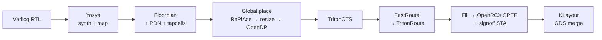

# rtl2gds-sta-lab

Take real RTL through the **OpenROAD-flow-scripts (ORFS)** RTL→GDS flow on the
open **sky130hd** PDK, then write the STA/CTS/PPA analysis a strong junior
physical-design engineer would present — every number script-extracted from the
tool logs, nothing hand-typed.

> Built as interview-prep evidence for "deliver a synthesis/timing-clean
> design", "logic synthesis and timing analysis", and "run synthesis, review
> QoR" — backing STA and CTS theory with artifacts I generated and can defend
> line by line.

## Status

| Stage | State |
|---|---|
| 0. Environment bring-up + toolchain proof | ✅ done |
| 1. Flow bring-up (smallest config end-to-end) | ✅ `gcd`/sky130hd RTL→GDS, 0 DRC |
| 2. STA deep-dive (constraints, top-5 setup/hold) | 🔜 |
| 3. CTS analysis (pre/post, skew, topology) | 🔜 |
| 4. Experiments E1–E4 (Fmax wall, pipelining, util, CDC) | 🔜 |
| 5. `docs/sta_cts_field_notes.md` | 🔜 (skeleton in repo) |
| 6. Final PPA table + layout screenshots + resume bullets | 🔜 |

The lab design is **lowRISC Ibex** (the `axi-qos-fabric` repo is not present in
this workspace, so per the project brief we fall back to Ibex). `gcd` is used
only as the fast end-to-end smoke test.

## Toolchain (and why it isn't the ORFS Docker image)

The canonical ORFS path is `docker pull openroad/orfs`. In this environment the
Docker **daemon starts**, but the image-layer CDN
(`production.cloudfront.docker.com`) is firewalled — every blob returns
HTTP 403 — so no image can be pulled. We therefore run **native binaries** and
use the ORFS git tree only for its flow scripts + sky130hd platform files:

| Tool | Source | Version (pinned) |
|---|---|---|
| OpenROAD (OpenSTA compiled in) | conda `litex-hub` | `f12e2f474` (build `2.0_3175`) |
| Yosys + ABC | conda `conda-forge` | `0.65` |
| KLayout | apt (Ubuntu universe) | `0.28.16` |
| ORFS flow scripts + sky130hd | git, pinned | `de0a109f4` (2022-03-03) |

ORFS is pinned to the era of the conda OpenROAD so its Tcl only uses commands
present in that binary. Full detection log and rationale:
[`docs/00_environment.md`](docs/00_environment.md). Captured versions:
[`docs/tool_versions.txt`](docs/tool_versions.txt).

## Flow



## Quickstart

```bash
# 1. one-time toolchain bring-up (Miniforge + conda envs + ORFS pin)
scripts/bootstrap.sh
source scripts/env.sh

# 2. prove the flow end-to-end on the smallest design
make smoke                 # gcd/sky130hd -> routed DEF, 0 DRC

# 3. signoff + QoR on it
make finish                # fill + OpenRCX SPEF + GDS
make sta                   # top-5 setup/hold paths + skew (uses extracted SPEF)
make report                # parse logs -> reports/gcd_base_qor.md

# 4. drive any config (clock ladder, util sweeps, Ibex) the same way
make route CONFIG=config/<variant>.mk
```

Every `make` target is a thin wrapper over the pinned ORFS tree with our
toolchain on `PATH`; see [`Makefile`](Makefile).

## Repo layout

```
scripts/bootstrap.sh        reproducible toolchain install (idempotent)
scripts/env.sh              PATH / tool handles / CA bundle (source it)
scripts/sta/signoff_sta.tcl signoff STA: top-5 setup+hold, skew, area, power
scripts/parse/parse_flow.py raw logs -> markdown QoR (no hand numbers)
config/                     ORFS config.mk variants (clock ladder, sweeps)  [grows per stage]
designs/                    RTL + constraints brought into the repo          [grows per stage]
reports/                    GENERATED markdown tables
docs/                       environment notes, STA/CTS field notes
artifacts/screenshots/      layout images
```

## Results so far — `gcd` / sky130hd smoke

Snapshot of [`reports/gcd_base_qor.md`](reports/gcd_base_qor.md) (produced by
`make report`; clock 4.3647 ns from the design SDC):

| Metric | Value |
|---|---|
| Setup worst slack (ns) | +0.4054 |
| Hold worst slack (ns) | +0.5328 |
| Setup/Hold violations | 0 / 0 |
| Implied Fmax (MHz) | 252.6 |
| Design area (µm²) | 4100 |
| Total power (W) | 1.060e-03 |
| Route wirelength (µm) | 10937 |
| Route DRC violations | 0 |

## Final PPA table / screenshots / resume bullets

_Filled in stage 6 once Ibex + the experiment matrix are complete._
