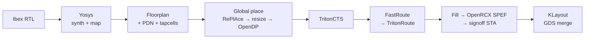
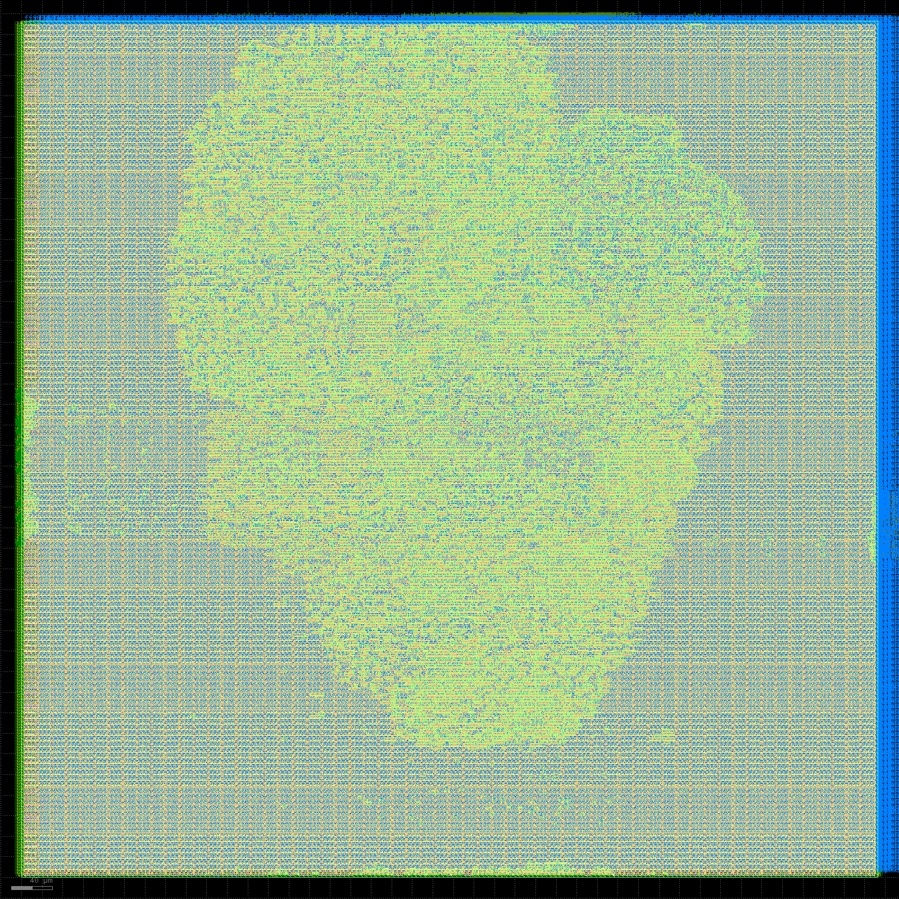

# rtl2gds-sta-lab

Take real RTL through the **OpenROAD-flow-scripts (ORFS)** RTL→GDS flow on the
open **sky130hd** PDK, then write the STA / CTS / PPA analysis a strong junior
physical-design engineer would present — **every number script-extracted from
the tool logs, nothing hand-typed** (`scripts/gen_reports.sh` regenerates all of
`reports/`).

> Interview-prep evidence for "deliver a synthesis/timing-clean design", "logic
> synthesis and timing analysis", and "run synthesis, review QoR" — backing STA
> and CTS theory with artifacts I generated and can defend line by line.

Design under study: **lowRISC Ibex** (RV32IMC core, 16,175 synthesized standard
cells / 19,722 nets; 95k final instances incl. fill).
`gcd` is the fast end-to-end smoke test.

## Status — all deliverables complete

| # | Deliverable | Where |
|---|---|---|
| 0 | Environment + toolchain bring-up | [`docs/00_environment.md`](docs/00_environment.md) |
| 1 | Flow bring-up (gcd RTL→GDS, 0 DRC) | [`reports/gcd_base_qor.md`](reports/gcd_base_qor.md) |
| 2 | STA deep-dive (top-5 setup/hold, defensible SDC) | [`docs/sta_deep_dive.md`](docs/sta_deep_dive.md), [`docs/constraints.md`](docs/constraints.md), [`reports/ibex_sta_paths.md`](reports/ibex_sta_paths.md) |
| 3 | CTS analysis (pre/post, skew, topology) | [`reports/ibex_cts_analysis.md`](reports/ibex_cts_analysis.md) |
| 4 | Experiments E1/E2/E3 | [`reports/E1_clock_sweep.md`](reports/E1_clock_sweep.md), [`reports/E2_pipelining.md`](reports/E2_pipelining.md), [`reports/E3_util_sweep.md`](reports/E3_util_sweep.md) |
| 5 | STA/CTS field notes (theory + my numbers) | [`docs/sta_cts_field_notes.md`](docs/sta_cts_field_notes.md) |
| 6 | README: flow, PPA, layout, resume bullets | this file |

## Toolchain (and why it isn't the ORFS Docker image)

`docker pull openroad/orfs` is the canonical path, but here the Docker **daemon
starts yet the layer CDN (`production.cloudfront.docker.com`) is firewalled —
every blob returns HTTP 403**, so no image can be pulled. So I run **native
binaries** and use the ORFS git tree only for its flow scripts + sky130hd files:

| Tool | Source | Pinned |
|---|---|---|
| OpenROAD (OpenSTA built in) | conda `litex-hub` | `f12e2f474` |
| Yosys + ABC | conda `conda-forge` | `0.65` |
| KLayout | apt | `0.28.16` |
| ORFS scripts + sky130hd | git | `de0a109f4` (same era as the OpenROAD binary) |

Detection log + every gotcha (TLS MITM CA, per-tool conda envs, `pipefail`→bash,
ORFS pin rationale): [`docs/00_environment.md`](docs/00_environment.md).
Reproduce: `scripts/bootstrap.sh && source scripts/env.sh`.

## Flow



```bash
scripts/bootstrap.sh && source scripts/env.sh   # one-time toolchain
make smoke                                       # gcd RTL→GDS proof
make route  CONFIG=config/ibex/clk19.mk FLOW_VARIANT=clk19   # any variant
make sta    CONFIG=config/ibex/clk19.mk FLOW_VARIANT=clk19   # top-5 paths + skew
scripts/run_finish.sh   # full Ibex experiment batch (E1/E2/E3)
scripts/gen_reports.sh  # raw logs → every markdown table in reports/
```

## Final PPA per configuration

Snapshot of [`reports/PPA_summary.md`](reports/PPA_summary.md). **base** is full
post-route SPEF signoff; the sweeps are post-CTS/global-route (≈1.5 ns optimistic
vs signoff — see [`docs/sta_deep_dive.md`](docs/sta_deep_dive.md)).

| Configuration | Fmax (MHz) | Setup WS (ns) | Hold WS (ns) | Area (µm²) | Power (mW) |
|---|--:|--:|--:|--:|--:|
| 17.4 ns — signoff (SPEF, full route) | 53.0 | −1.454 | −0.721 | 212400 | 20.40 |
| 22 ns — signoff (SPEF, full route) | 45.3 | −0.087 | −0.797 | 181236 | 18.50 |
| 19 ns — post-CTS | 52.9 | +0.091 | −0.021 | 200371 | 20.60 |
| 19 ns, WritebackStage=1 — post-CTS | 52.8 | +0.073 | −0.040 | 186649 | 18.00 |
| 19 ns, util 40% — global-route | 53.0 | +0.137 | −0.029 | 195630 | 17.10 |

**Findings:** Ibex on sky130hd is **logic-depth bound** — the critical path is a
35-level instruction-fetch-address datapath that is **99 % cell delay, 1 % wire**.
At post-route **SPEF signoff** ([`reports/E1b_signoff_sweep.md`](reports/E1b_signoff_sweep.md))
setup essentially closes at **~22 ns (WNS −0.09 → Fmax ≈ 45 MHz)**; the 17.4 ns
ORFS default fails by −1.45 ns (post-CTS estimates ran **~2 ns optimistic**).
**Hold stays −0.5…−0.8 ns at every clock** — it's bound by the **4.54 ns CTS
skew**, not the period, so the design is **setup-closable but hold-limited**: the
real closure blocker is the clock tree (needs CTS rebalancing, not a slower
clock), and `repair_timing -hold` only recovered it from −2.64 to −0.72 ns. A
sharper, more honest result than a trivially clean design.

## Layout (routed Ibex, sky130hd)



Square die, clustered standard-cell placement (sparse edges = 20 % utilization),
power straps right — rendered headless with KLayout (`scripts/klayout_png.py`).

## Experiments (the differentiator)

- **E1 — Fmax wall** (post-CTS [`E1_clock_sweep.md`](reports/E1_clock_sweep.md);
  signoff [`E1b_signoff_sweep.md`](reports/E1b_signoff_sweep.md)): post-CTS setup
  crosses 0 at ~18–19 ns; **SPEF signoff** puts the real wall at **~22 ns
  (≈45 MHz)**. Hold is period-independent (±0.07 ns post-CTS; −0.5…−0.8 ns
  signoff). Critical endpoint never leaves the `instr_addr_o` fetch family
  ([`E1_path_migration.md`](reports/E1_path_migration.md)).
- **E2 — pipelining** ([`reports/E2_pipelining.md`](reports/E2_pipelining.md)):
  `WritebackStage` 0→1 leaves Fmax flat (52.9→52.8 MHz — wrong critical path) but
  cuts **area −7 %** and **power −13 %**, at +1 cycle latency.
- **E3 — utilization** ([`reports/E3_util_sweep.md`](reports/E3_util_sweep.md)):
  20 %→40 % keeps Fmax flat while peak global-route usage climbs 29 %→55 %; **60 %
  is placement-infeasible** (RePlAce GPL-0302 density wall).

## Résumé bullets (every number traceable to a report here)

- Implemented **lowRISC Ibex (RV32 core, 16,175 standard cells) RTL→GDSII on the
  open sky130 PDK** with OpenROAD / Yosys / OpenSTA, reaching **0-DRC** detailed
  routing; built a parameterized **Make + Python** flow that auto-extracts all QoR
  (WNS/TNS, skew, insertion, power, congestion) from tool logs — **zero
  hand-edited numbers** across 10 staged commits.
- Ran **post-route signoff STA on extracted SPEF**: located the **Fmax wall at
  ~22 ns (≈45 MHz)** via a clock-period ladder, root-caused the critical path as a
  **35-level instruction-fetch datapath (99 % cell-delay, 1 % wire)**, and showed
  post-CTS estimates ran **~2 ns optimistic** vs SPEF signoff.
- Root-caused a **hold-closure limit as clock-skew-bound, not period-bound**:
  characterized TritonCTS **skew 4.54 ns / insertion 6.84 ns** over a **126-buffer
  dual clock tree**, with CTS-created hold (**−2.64 ns**) recovered to **−0.72 ns**
  by `repair_timing -hold`, and demonstrated hold's period-independence across a
  15–22 ns sweep.
- Ran **PPA trade-off experiments**: an Ibex **`WritebackStage` pipelining flip
  cut area 7 % and power 13 %** (+1-cycle latency) with Fmax flat (critical path
  elsewhere); a **utilization sweep** mapped the density wall — routable at 40 %
  (peak global-route usage 55 %), **placement-infeasible at 60 %** (RePlAce
  GPL-0302).
