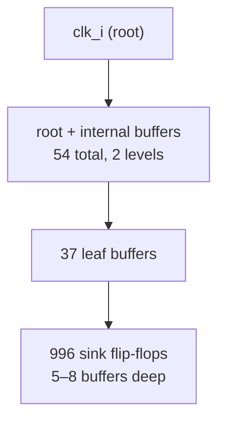

# CTS analysis — Ibex baseline (sky130hd)

_Auto-generated by `scripts/cts/cts_report.py` from ORFS CTS logs + signoff STA._

## Pre-CTS vs post-CTS

| Quantity | Pre-CTS (ideal clock) | Post-CTS (propagated) |
|---|---|---|
| Clock model | ideal (0 latency, 0 skew) | real buffer tree |
| Clock skew (ns) | 0 (by definition) | 4.540 |
| Insertion delay / latency (ns) | 0 | 6.840 |
| Clock buffers added | 0 | 126 |
| Hold WS — post-CTS, before hold-repair (ns) | n/a (no skew) | -2.640 |
| Hold WS — signoff, after routing hold-repair (ns) | n/a | -0.721 |

**Why hold breaks at CTS and not before:** with an ideal clock the launch and capture edges are simultaneous, so short paths have huge hold margin. CTS gives the clock real insertion delay and **skew** between launch and capture sinks; that skew eats directly into the hold budget (`slack_hold = t_clk2q + t_comb(min) - t_hold - skew`), creating the violations above (worst **-2.640 ns** at this 4.54 ns skew). `repair_timing -hold` (run during routing, not at CTS) inserts delay cells and recovers hold to **-0.721 ns** at signoff — improved but not fully closed, because 17.4 ns over-constrains this design (see E1: hold closes at the achievable clock).

## Clock-tree topology

### Clock net `clk_i`  (996 sinks)
- buffers: **54** (leaf 37)
- buffers in clock path: 5–8
- tree levels: 2

### Clock net `clk`  (943 sinks)
- buffers: **72** (leaf 47)
- buffers in clock path: 5–7
- tree levels: 2

### Topology sketch — `clk_i`

